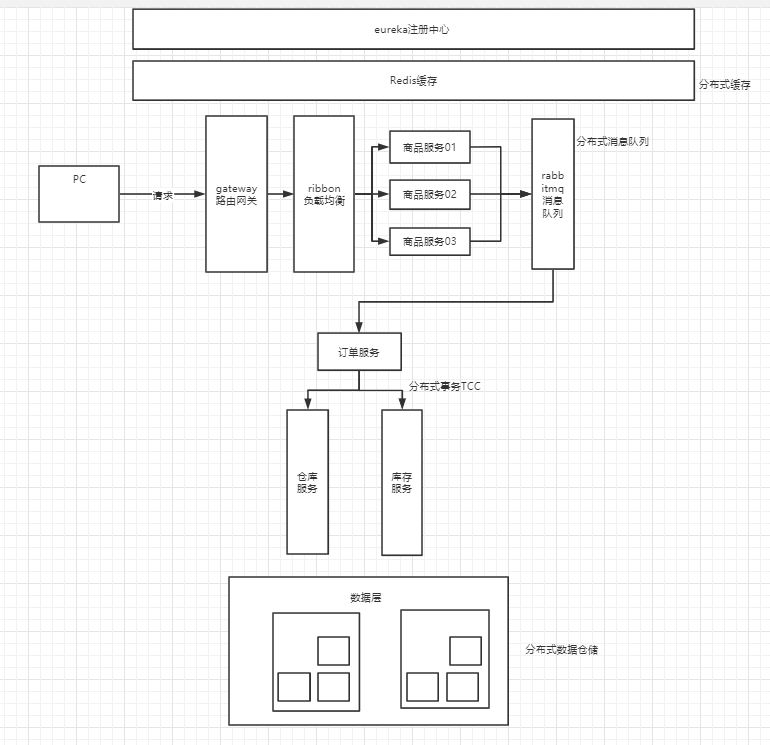

# 基于SpirngCloud的秒杀系统

@Author:zxw

@School:吉首大学

------

整体实现思路

# 1.单一应用环境下

1. 环境：
   1. 库存10000
   2. 并发请求5000

## 1.在无锁的情况下

1. 最终结果28秒，高并发不可用

## 2.在synchronized条件下

1. 通过在方法名加上synchronized关键字，最终结果33秒，结果超出1，会有细微精度的丢失,当购买数量刚好相等时，精度无丢失
2. 通过使用synchronized语句块对this加锁，最终结果21秒，高并发不可用

## 3.使用乐观锁CAS算法

1. 使用无限循环判断在100ms内一直重试直到更改成功，最终结果39秒,结果准确
2. 使用循环次数重试机制，次数为3，最终结果33秒，结果准确

# 2. 分布式应用环境下

1. 使用Redis+RabbitMQ实现异步抢购，减少后台压力

# 3.项目遇到的问题

## 3.1 Zipkin

1. ```java
   java.lang.IllegalArgumentException: Prometheus requires that all meters with the same name have the same set of tag keys. There is already an existing meter containing tag keys [exception, method, status, uri]. The meter you are attempting to register has keys [method, status, uri].
   ```

   ```yml
   server:
     port: 9411
   spring:
     application:
       name: zipkin-server
   
   management:
     metrics:
       web:
         server:
           auto-time-requests: false
     endpoints:
       web:
         exposure:
           include: "*"
   ```


# 4.扩展

## 4.1 分布式锁解决超买，超卖问题

其他解决方案：悲观锁，分布式锁，乐观锁，队列串行化，Redis原子操作

## 4.2 分布式锁性能优化

缺陷：同一商品多用户下单时，会导致串行化

解决方案：分段加锁，将商品数量进行拆分，然后使用随机算法将请求分发到不同的库存段中，当前库存为空时，则去寻找下一个分段库存。

eval "local request_times = redis.call('incr',KEYS[1]);if request_times == 1 then redis.call('expire',KEYS[1], ARGV[1]) end;if request_times > tonumber(ARGV[2]) then return 0 end return 1;" 1 test_127.0.0.1 10 3
4
# 优化思路以及注意重点

核心：流量控制和性能优化

方向：将请求拦截在上游，读多写少使用缓存

细节：

1. 查询按钮禁止重复提交，拦截无效请求
2. 页面缓存，限制访问频度，返回相同的页面。item缓存，返回同一页面
3. 防止缓存穿透
4. 容灾，限流，降级
5. 可扩展架构
6. 全链路高可用
7. 高并发架构
8. 高性能架构

# 问题解决

1. 如何解决卖超问题

   ```
   分布式锁
   分布式锁优化
   ```

2. 对象级缓存redis

   ```
   缓存预热
   ```

3. 订单处理队列rabbitmq

   ```
   快速响应
   异步下单，缓存队列
   ```

4. 解决分布式session

   ```
   用户ip访问次数限制
   ```

5. 秒杀安全 -- 安全性设计

   ```
   接口限流
   验证码
   秒杀接口隐藏
   ```

6. redis的库存如何与数据库的库存保持一致

   ```
   无需强一致性，防止请求穿透数据库
   ```

7. 分布式事物解决方案（已更新 -- 最新的思路和写法）

8. mysql主从复制思路及实操（未更新代码）

9. 如何进行分库分表

10. 秒杀类似场景sql的写法注意事项有哪些？

11. 如何利用lua脚本进行操作限流与分布式锁（可保证原子性）？

12. 如何利用lua脚本进行分布式锁操作？

13. ** 如何利用lua + redis 取代 nigix + lua 脚本进行分布式限流 (请看miaosha-2version) ？ ***

